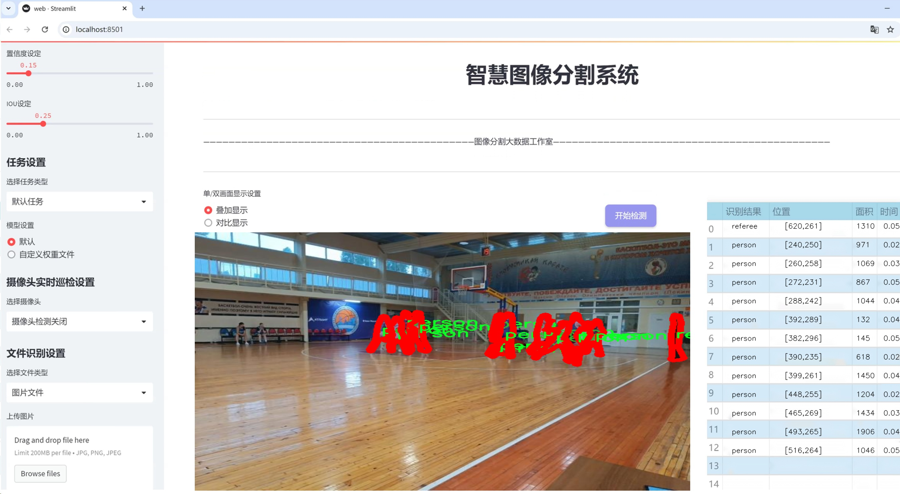
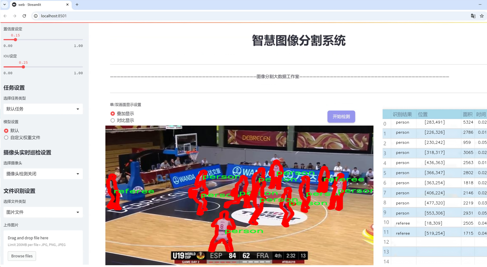
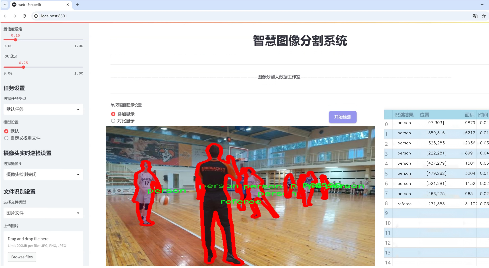
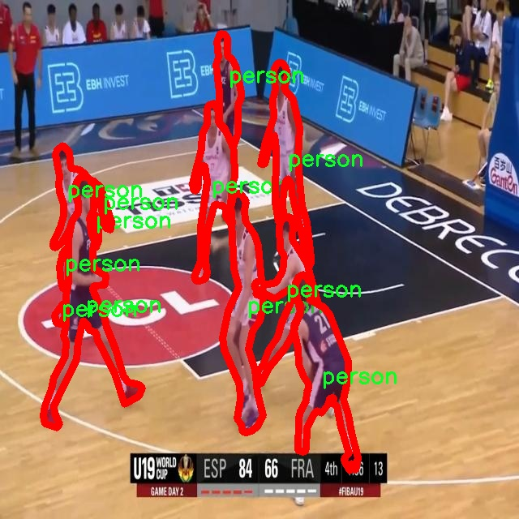
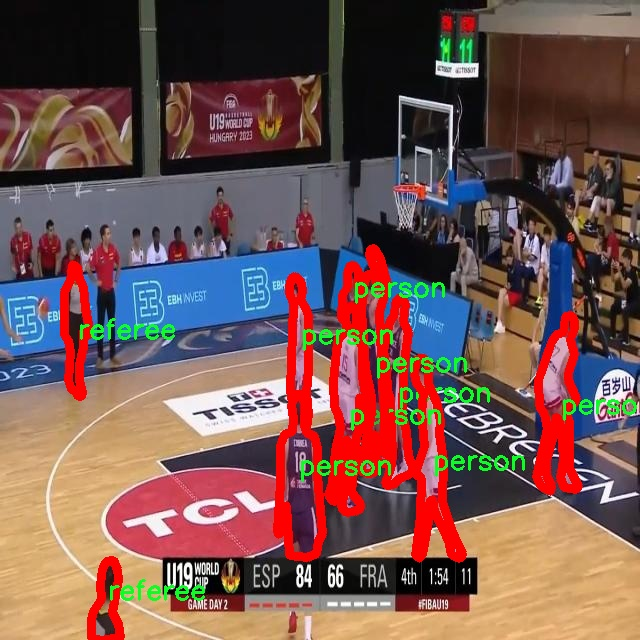
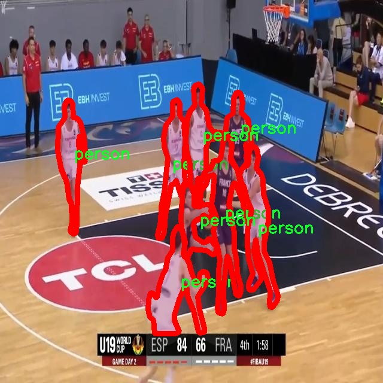
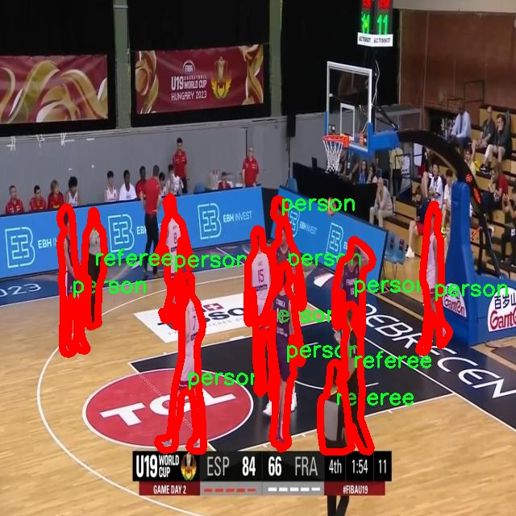
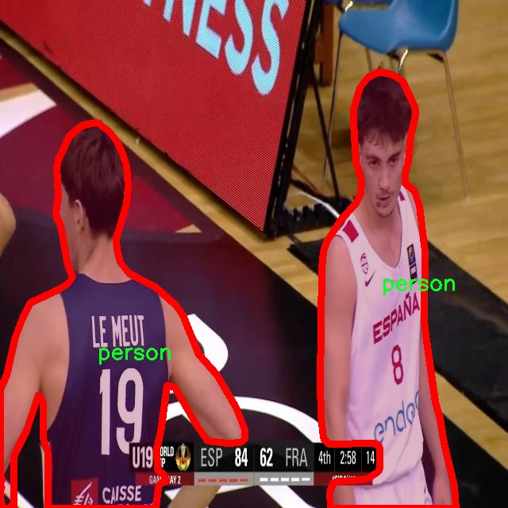

# 运动员场景分割系统源码＆数据集分享
 [yolov8-seg-HGNetV2＆yolov8-seg-aux等50+全套改进创新点发刊_一键训练教程_Web前端展示]

### 1.研究背景与意义

项目参考[ILSVRC ImageNet Large Scale Visual Recognition Challenge](https://gitee.com/YOLOv8_YOLOv11_Segmentation_Studio/projects)

项目来源[AAAI Global Al lnnovation Contest](https://kdocs.cn/l/cszuIiCKVNis)

研究背景与意义

随着体育产业的快速发展，运动员在比赛中的表现与技术水平越来越受到关注。为了提高比赛的观赏性和分析的精准性，运动场景的自动化分析成为了研究的热点之一。尤其是在球类运动中，运动员的动态表现、战术配合以及比赛策略的实施都与场景的实时分析密切相关。传统的运动分析方法往往依赖于人工标注和视频回放，效率低下且容易受到主观因素的影响。因此，基于计算机视觉技术的运动员场景分割系统应运而生，成为提升比赛分析效率和准确性的有效工具。

在众多计算机视觉算法中，YOLO（You Only Look Once）系列模型因其高效的实时目标检测能力而备受青睐。YOLOv8作为该系列的最新版本，结合了深度学习的最新进展，具备了更强的特征提取能力和更快的推理速度。然而，尽管YOLOv8在目标检测方面表现出色，但在复杂运动场景的实例分割任务中仍存在一定的局限性。为此，改进YOLOv8以适应运动员场景分割的需求，不仅是技术上的挑战，更是推动体育数据分析智能化的重要一步。

本研究基于改进YOLOv8的运动员场景分割系统，利用包含5500张图像的多类别数据集进行训练和验证。该数据集涵盖了7个类别，包括球、网球运动员、背景板、篮球、运动员和裁判等，能够全面反映比赛中的多样化场景。这些类别的选择不仅符合实际比赛中的常见元素，还为系统的训练提供了丰富的样本，增强了模型的泛化能力和鲁棒性。通过对这些图像的深入分析，研究旨在实现对运动员及其周边环境的精准分割，从而为后续的战术分析、运动员表现评估和实时数据反馈提供可靠的数据支持。

此外，运动员场景分割系统的研究意义还体现在其对体育教育和训练的促进作用。通过对运动员在比赛中的动态行为进行细致的分析，教练员可以更好地理解运动员的技术特点和战术执行情况，从而制定更为科学的训练计划。同时，运动员自身也可以通过数据反馈了解自己的优缺点，进行针对性的改进。更重要的是，随着智能体育设备的普及，基于此系统的应用将有助于推动智能化训练和比赛分析的发展，提升运动员的整体竞技水平。

综上所述，基于改进YOLOv8的运动员场景分割系统不仅具有重要的学术研究价值，也在实际应用中展现出广阔的前景。通过本研究的深入开展，将为体育数据分析的智能化进程贡献一份力量，同时为未来的研究提供新的思路和方法。

### 2.图片演示







##### 注意：由于此博客编辑较早，上面“2.图片演示”和“3.视频演示”展示的系统图片或者视频可能为老版本，新版本在老版本的基础上升级如下：（实际效果以升级的新版本为准）

  （1）适配了YOLOV8的“目标检测”模型和“实例分割”模型，通过加载相应的权重（.pt）文件即可自适应加载模型。

  （2）支持“图片识别”、“视频识别”、“摄像头实时识别”三种识别模式。

  （3）支持“图片识别”、“视频识别”、“摄像头实时识别”三种识别结果保存导出，解决手动导出（容易卡顿出现爆内存）存在的问题，识别完自动保存结果并导出到tempDir中。

  （4）支持Web前端系统中的标题、背景图等自定义修改，后面提供修改教程。

  另外本项目提供训练的数据集和训练教程,暂不提供权重文件（best.pt）,需要您按照教程进行训练后实现图片演示和Web前端界面演示的效果。

### 3.视频演示

[3.1 视频演示](https://www.bilibili.com/video/BV1uJ1BYCEmW/)

### 4.数据集信息展示

##### 4.1 本项目数据集详细数据（类别数＆类别名）

nc: 2
names: ['person', 'referee']


##### 4.2 本项目数据集信息介绍

数据集信息展示

在现代计算机视觉领域，运动员场景分割的研究逐渐成为一个重要的研究方向，尤其是在体育分析、智能监控和虚拟现实等应用中。为此，我们构建了一个名为“Players Segmentation”的数据集，旨在为改进YOLOv8-seg模型提供高质量的训练数据。该数据集专注于运动场景中的关键角色，具体包括“person”（运动员）和“referee”（裁判）两个类别，具有良好的代表性和应用价值。

“Players Segmentation”数据集的设计考虑到了多样性和复杂性，以确保模型在不同场景下的鲁棒性。数据集中包含了多种运动类型的图像，涵盖了足球、篮球、网球等多种运动项目。这些图像不仅包括了运动员在比赛中的动态表现，还包含了他们在训练、热身和休息等不同状态下的静态图像。通过这种多样化的场景设置，数据集能够有效地捕捉到运动员和裁判在不同环境和条件下的外观特征。

在数据集的构建过程中，我们特别注重图像的标注质量。每张图像都经过专业标注团队的仔细处理，确保“person”和“referee”两个类别的准确性和一致性。标注过程中，采用了先进的图像分割技术，确保每个目标的边界清晰可辨。这种高质量的标注不仅提高了数据集的实用性，也为后续的模型训练提供了坚实的基础。

数据集的大小和样本数量也是影响模型性能的重要因素。为了增强模型的泛化能力，“Players Segmentation”数据集包含了数千张经过精心挑选的图像，涵盖了不同的光照条件、天气变化和场地类型。这种丰富的样本量使得模型在训练过程中能够学习到更为复杂的特征，从而在实际应用中表现出色。

此外，数据集还考虑到了不同场景下的背景复杂性。通过在不同的运动场地和环境中采集图像，数据集确保了运动员和裁判在各种背景下的分割效果。这种背景的多样性使得模型能够更好地适应实际应用中的各种情况，提升了运动员场景分割的准确性和可靠性。

总之，“Players Segmentation”数据集不仅为改进YOLOv8-seg的运动员场景分割系统提供了丰富的训练素材，还通过高质量的标注和多样化的场景设置，为计算机视觉领域的研究提供了宝贵的资源。随着数据集的不断完善和扩展，我们期待其在运动分析、智能监控等领域的广泛应用，推动相关技术的进步与发展。











### 5.全套项目环境部署视频教程（零基础手把手教学）

[5.1 环境部署教程链接（零基础手把手教学）](https://www.bilibili.com/video/BV1jG4Ve4E9t/?vd_source=bc9aec86d164b67a7004b996143742dc)


[5.2 安装Python虚拟环境创建和依赖库安装视频教程链接（零基础手把手教学）](https://www.bilibili.com/video/BV1nA4VeYEze/?vd_source=bc9aec86d164b67a7004b996143742dc)

### 6.手把手YOLOV8-seg训练视频教程（零基础小白有手就能学会）

[6.1 手把手YOLOV8-seg训练视频教程（零基础小白有手就能学会）](https://www.bilibili.com/video/BV1cA4VeYETe/?vd_source=bc9aec86d164b67a7004b996143742dc)


按照上面的训练视频教程链接加载项目提供的数据集，运行train.py即可开始训练



     Epoch   gpu_mem       box       obj       cls    labels  img_size
     1/200     0G   0.01576   0.01955  0.007536        22      1280: 100%|██████████| 849/849 [14:42<00:00,  1.04s/it]
               Class     Images     Labels          P          R     mAP@.5 mAP@.5:.95: 100%|██████████| 213/213 [01:14<00:00,  2.87it/s]
                 all       3395      17314      0.994      0.957      0.0957      0.0843

     Epoch   gpu_mem       box       obj       cls    labels  img_size
     2/200     0G   0.01578   0.01923  0.007006        22      1280: 100%|██████████| 849/849 [14:44<00:00,  1.04s/it]
               Class     Images     Labels          P          R     mAP@.5 mAP@.5:.95: 100%|██████████| 213/213 [01:12<00:00,  2.95it/s]
                 all       3395      17314      0.996      0.956      0.0957      0.0845

     Epoch   gpu_mem       box       obj       cls    labels  img_size
     3/200     0G   0.01561    0.0191  0.006895        27      1280: 100%|██████████| 849/849 [10:56<00:00,  1.29it/s]
               Class     Images     Labels          P          R     mAP@.5 mAP@.5:.95: 100%|███████   | 187/213 [00:52<00:00,  4.04it/s]
                 all       3395      17314      0.996      0.957      0.0957      0.0845


### 7.50+种全套YOLOV8-seg创新点代码加载调参视频教程（一键加载写好的改进模型的配置文件）

[7.1 50+种全套YOLOV8-seg创新点代码加载调参视频教程（一键加载写好的改进模型的配置文件）](https://www.bilibili.com/video/BV1Hw4VePEXv/?vd_source=bc9aec86d164b67a7004b996143742dc)

### 8.YOLOV8-seg图像分割算法原理

原始YOLOv8-seg算法原理

YOLOv8-seg作为YOLO系列的最新版本，标志着目标检测与图像分割技术的又一次飞跃。该算法的设计理念不仅关注于目标的定位，还将图像分割的能力融入其中，使得模型在处理复杂场景时能够提供更为精细的语义信息。YOLOv8-seg的核心架构由输入层、主干网络、颈部网络和头部网络等多个部分构成，每个部分都经过精心设计，以确保模型在性能和效率上的最佳平衡。

在YOLOv8-seg的工作流程中，首先，输入图像会被调整为指定的尺寸，以满足网络的输入要求。这一过程虽然看似简单，但对于后续特征提取的有效性至关重要。图像的缩放不仅保持了图像的比例，还确保了模型能够在不同分辨率下进行有效的特征学习。

接下来，主干网络通过一系列卷积操作对输入图像进行下采样，提取出高层次的特征。YOLOv8-seg的主干网络采用了CSP（Cross Stage Partial）结构，将特征提取过程分为两部分，分别进行卷积和连接。这种设计不仅提高了特征提取的效率，还增强了模型的表达能力。此外，主干网络中的每个卷积层都包含批归一化和SiLUR激活函数，这些技术的结合使得网络在训练过程中能够更快地收敛，并减少了过拟合的风险。

在特征提取的过程中，YOLOv8-seg引入了C2f模块，这一模块借鉴了YOLOv7中的E-ELAN结构，通过跨层分支连接来增强模型的梯度流。这种设计使得网络能够更好地捕捉到多层次的特征信息，从而提升了检测和分割的精度。主干网络的末尾，SPP（Spatial Pyramid Pooling）模块通过三个最大池化层的组合，进一步增强了网络对多尺度特征的处理能力，使得模型在面对不同大小的目标时，能够保持较高的检测性能。

颈部网络的设计同样至关重要。YOLOv8-seg采用了FPNS（Feature Pyramid Network）和PAN（Path Aggregation Network）结构，以实现不同尺度特征图的信息融合。这一过程通过自底向上的特征融合，使得网络能够综合利用来自不同层次的特征信息，从而提高目标检测和分割的精度。通过这种特征融合，YOLOv8-seg能够在复杂场景中更好地理解目标的上下文信息，进而提升分割的准确性。

在头部网络中，YOLOv8-seg采用了解耦的检测头结构。这一结构通过两个并行的卷积分支，分别计算回归和类别的损失。这种设计的优势在于，模型可以在处理目标定位和分类任务时，减少相互之间的干扰，从而提高整体的检测性能。此外，YOLOv8-seg的损失函数采用了CloU（Class-wise Localization Uncertainty），这一损失函数的设计旨在更好地处理类别不平衡问题，使得模型在面对多类别目标时，能够更准确地进行分类和定位。

YOLOv8-seg的另一个显著特点是其Anchor-Free的检测方式。这一设计理念的核心在于，传统的目标检测方法往往依赖于预定义的锚框，而YOLOv8-seg则通过自适应的方式，直接从特征图中生成目标的边界框。这种方法不仅简化了模型的设计，还提高了检测的灵活性，使得模型能够更好地适应不同场景下的目标形态。

综上所述，YOLOv8-seg算法通过其独特的架构设计和创新的技术手段，成功地将目标检测与图像分割相结合，形成了一种高效、准确的视觉识别解决方案。无论是在实时性还是精度上，YOLOv8-seg都展现出了强大的能力，为各类应用场景提供了新的可能性。在未来，随着技术的不断进步，YOLOv8-seg有望在更多领域发挥其潜力，推动目标检测和图像分割技术的进一步发展。


### 9.系统功能展示（检测对象为举例，实际内容以本项目数据集为准）

图9.1.系统支持检测结果表格显示

  图9.2.系统支持置信度和IOU阈值手动调节

  图9.3.系统支持自定义加载权重文件best.pt(需要你通过步骤5中训练获得)

  图9.4.系统支持摄像头实时识别

  图9.5.系统支持图片识别

  图9.6.系统支持视频识别

  图9.7.系统支持识别结果文件自动保存

  图9.8.系统支持Excel导出检测结果数据


### 10.50+种全套YOLOV8-seg创新点原理讲解（非科班也可以轻松写刊发刊，V11版本正在科研待更新）

#### 10.1 由于篇幅限制，每个创新点的具体原理讲解就不一一展开，具体见下列网址中的创新点对应子项目的技术原理博客网址【Blog】：


[10.1 50+种全套YOLOV8-seg创新点原理讲解链接](https://gitee.com/qunmasj/good)

#### 10.2 部分改进模块原理讲解(完整的改进原理见上图和技术博客链接)
### YOLOv8简介
YOLOv8 尚未发表论文，因此我们无法直接了解其创建过程中进行的直接研究方法和消融研究。话虽如此，我们分析了有关模型的存储库和可用信息，以开始记录 YOLOv8 中的新功能。

如果您想自己查看代码，请查看YOLOv8 存储库并查看此代码差异以了解一些研究是如何完成的。

在这里，我们提供了有影响力的模型更新的快速总结，然后我们将查看模型的评估，这不言自明。

GitHub 用户 RangeKing 制作的下图显示了网络架构的详细可视化。


在这里插入图片描述


在这里插入图片描述

YOLOv8 架构，GitHub 用户 RangeKing 制作的可视化

无锚检测
YOLOv8 是一个无锚模型。这意味着它直接预测对象的中心而不是已知锚框的偏移量。


YOLO中anchor box的可视化

锚框是早期 YOLO 模型中众所周知的棘手部分，因为它们可能代表目标基准框的分布，而不是自定义数据集的分布。


YOLOv8 的检测头，在netron.app中可视化

Anchor free 检测减少了框预测的数量，从而加速了非最大抑制 (NMS)，这是一个复杂的后处理步骤，在推理后筛选候选检测。


YOLOv8 的检测头，在netron.app中可视化

新的卷积
stem 的第一个6x6conv 被替换为 a 3x3，主要构建块被更改，并且C2f替换了C3。该模块总结如下图，其中“f”是特征数，“e”是扩展率，CBS是由a Conv、a BatchNorm、a组成的block SiLU。

在中， （两个具有剩余连接的 3x3C2f的奇特名称）的所有输出都被连接起来。而在仅使用最后一个输出。Bottleneck``convs``C3``Bottleneck


新的 YOLOv8C2f模块

这Bottleneck与 YOLOv5 中的相同，但第一个 conv 的内核大小从更改1x1为3x3. 从这些信息中，我们可以看到 YOLOv8 开始恢复到 2015 年定义的 ResNet 块。

在颈部，特征直接连接而不强制使用相同的通道尺寸。这减少了参数数量和张量的整体大小。

### 空间和通道重建卷积SCConv
参考该博客提出的一种高效的卷积模块，称为SCConv (spatial and channel reconstruction convolution)，以减少冗余计算并促进代表性特征的学习。提出的SCConv由空间重构单元(SRU)和信道重构单元(CRU)两个单元组成。

（1）SRU根据权重分离冗余特征并进行重构，以抑制空间维度上的冗余，增强特征的表征。

（2）CRU采用分裂变换和融合策略来减少信道维度的冗余以及计算成本和存储。

（3）SCConv是一种即插即用的架构单元，可直接用于替代各种卷积神经网络中的标准卷积。实验结果表明，scconvo嵌入模型能够通过减少冗余特征来获得更好的性能，并且显著降低了复杂度和计算成本。


SCConv如图所示，它由两个单元组成，空间重建单元(SRU)和通道重建单元(CRU)，以顺序的方式放置。具体而言，对于瓶颈残差块中的中间输入特征X，首先通过SRU运算获得空间细化特征Xw，然后利用CRU运算获得信道细化特征Y。SCConv模块充分利用了特征之间的空间冗余和通道冗余，可以无缝集成到任何CNN架构中，以减少中间特征映射之间的冗余并增强CNN的特征表示。

#### SRU单元用于空间冗余


为了利用特征的空间冗余，引入了空间重构单元(SRU)，如图2所示，它利用了分离和重构操作。

分离操作 的目的是将信息丰富的特征图与空间内容对应的信息较少的特征图分离开来。我们利用组归一化(GN)层中的比例因子来评估不同特征图的信息内容。具体来说，给定一个中间特征映射X∈R N×C×H×W，首先通过减去平均值µ并除以标准差σ来标准化输入特征X，如下所示:


其中µ和σ是X的均值和标准差，ε是为了除法稳定性而加入的一个小的正常数，γ和β是可训练的仿射变换。

GN层中的可训练参数\gamma \in R^{C}用于测量每个批次和通道的空间像素方差。更丰富的空间信息反映了空间像素的更多变化，从而导致更大的γ。归一化相关权重W_{\gamma} \in R^{C}由下面公式2得到，表示不同特征映射的重要性。


然后将经Wγ重新加权的特征映射的权值通过sigmoid函数映射到(0,1)范围，并通过阈值进行门控。我们将阈值以上的权重设置为1，得到信息权重W1，将其设置为0，得到非信息权重W2(实验中阈值设置为0.5)。获取W的整个过程可以用公式表示。


最后将输入特征X分别乘以W1和W2，得到两个加权特征:信息量较大的特征X_{1}^{\omega }和信息量较小的特征X_{2}^{\omega }。这样就成功地将输入特征分为两部分:X_{1}^{\omega }具有信息量和表达性的空间内容，而X_{2}^{\omega }几乎没有信息，被认为是冗余的。

重构操作 将信息丰富的特征与信息较少的特征相加，生成信息更丰富的特征，从而节省空间空间。采用交叉重构运算，将加权后的两个不同的信息特征充分结合起来，加强它们之间的信息流。然后将交叉重构的特征X^{\omega1}和X^{\omega2}进行拼接，得到空间精细特征映射X^{\omega}。从后过程表示如下：


其中⊗是逐元素的乘法，⊕是逐元素的求和，∪是串联。将SRU应用于中间输入特征X后，不仅将信息特征与信息较少的特征分离，而且对其进行重构，增强代表性特征，抑制空间维度上的冗余特征。然而，空间精细特征映射X^{\omega}在通道维度上仍然是冗余的。

#### CRU单元用于通道冗余


分割 操作将输入的空间细化特征X^{\omega}分割成两个部分，一部分通道数是\alpha C，另一部分通道数是(1-\alpha) C，随后对两组特征的通道数使用1 * 1卷积核进行压缩，分别得到X_{up}和X_{low}。

转换 操作将输入的X_{up}作为“富特征提取”的输入，分别进行GWC和PWC，然后相加得到输出Y1，将输入X_{low}作为“富特征提取”的补充，进行PWC，得到的记过和原来的输入取并集得到Y2。

融合 操作使用简化的SKNet方法来自适应合并Y1和Y2。具体说是首先使用全局平均池化将全局空间信息和通道统计信息结合起来，得到经过池化的S1和S2。然后对S1和S2做Softmax得到特征权重向量\beta _{1}和\beta _{2}，最后使用特征权重向量得到输出Y = \beta _{1}*Y_{1} + \beta _{2}*Y_{2}，Y即为通道提炼的特征。


### 11.项目核心源码讲解（再也不用担心看不懂代码逻辑）

#### 11.1 ui.py

以下是经过精简和注释的核心代码部分：

```python
import sys
import subprocess

def run_script(script_path):
    """
    使用当前 Python 环境运行指定的脚本。

    Args:
        script_path (str): 要运行的脚本路径
    """
    # 获取当前 Python 解释器的路径
    python_path = sys.executable

    # 构建运行命令，使用 streamlit 运行指定的脚本
    command = f'"{python_path}" -m streamlit run "{script_path}"'

    # 执行命令并等待其完成
    result = subprocess.run(command, shell=True)
    
    # 检查命令执行结果，如果返回码不为0，表示出错
    if result.returncode != 0:
        print("脚本运行出错。")

# 主程序入口
if __name__ == "__main__":
    # 指定要运行的脚本路径
    script_path = "web.py"  # 假设脚本在当前目录下

    # 调用函数运行脚本
    run_script(script_path)
```

### 代码说明：
1. **导入模块**：
   - `sys`：用于获取当前 Python 解释器的路径。
   - `subprocess`：用于执行外部命令。

2. **`run_script` 函数**：
   - 接受一个参数 `script_path`，表示要运行的 Python 脚本的路径。
   - 使用 `sys.executable` 获取当前 Python 解释器的路径。
   - 构建一个命令字符串，使用 `streamlit` 运行指定的脚本。
   - 使用 `subprocess.run` 执行命令，并等待其完成。
   - 检查命令的返回码，如果不为0，则输出错误信息。

3. **主程序入口**：
   - 当脚本作为主程序运行时，指定要运行的脚本路径（此处假设为 `web.py`）。
   - 调用 `run_script` 函数来执行该脚本。

这个程序文件名为 `ui.py`，其主要功能是通过当前的 Python 环境运行一个指定的脚本，具体是使用 Streamlit 来启动一个 Web 应用。

首先，文件中导入了一些必要的模块，包括 `sys`、`os` 和 `subprocess`。`sys` 模块用于访问与 Python 解释器相关的变量和函数，`os` 模块提供了与操作系统交互的功能，而 `subprocess` 模块则用于创建新进程、连接到它们的输入/输出/错误管道，并获取它们的返回码。

接下来，文件中定义了一个名为 `run_script` 的函数，该函数接受一个参数 `script_path`，表示要运行的脚本的路径。在函数内部，首先通过 `sys.executable` 获取当前 Python 解释器的路径。然后，构建一个命令字符串，使用 `streamlit run` 命令来运行指定的脚本。这里使用了格式化字符串，确保命令的正确性。

接着，使用 `subprocess.run` 方法执行构建好的命令。如果命令执行后返回的状态码不为零，表示脚本运行出错，程序会打印出相应的错误信息。

在文件的最后部分，使用 `if __name__ == "__main__":` 语句来确保只有在直接运行该脚本时才会执行以下代码。这部分代码指定了要运行的脚本路径，这里使用了 `abs_path` 函数来获取 `web.py` 文件的绝对路径。最后，调用 `run_script` 函数来执行这个脚本。

总体来说，这个程序的目的是为了方便地启动一个 Streamlit Web 应用，用户只需运行 `ui.py` 文件，程序会自动找到并执行 `web.py` 脚本。

#### 11.2 ultralytics\trackers\utils\matching.py

以下是代码中最核心的部分，并附上详细的中文注释：

```python
import numpy as np
import scipy
from scipy.spatial.distance import cdist
from ultralytics.utils.metrics import bbox_ioa

try:
    import lap  # 导入线性分配库
    assert lap.__version__  # 确保导入的库不是目录
except (ImportError, AssertionError, AttributeError):
    from ultralytics.utils.checks import check_requirements
    check_requirements('lapx>=0.5.2')  # 检查并更新到lap库
    import lap

def linear_assignment(cost_matrix, thresh, use_lap=True):
    """
    使用线性分配算法进行匹配。

    参数:
        cost_matrix (np.ndarray): 包含分配成本的矩阵。
        thresh (float): 认为分配有效的阈值。
        use_lap (bool, optional): 是否使用lap.lapjv。默认为True。

    返回:
        (tuple): 包含匹配索引、未匹配的索引（来自'a'）和未匹配的索引（来自'b'）的元组。
    """
    if cost_matrix.size == 0:
        # 如果成本矩阵为空，返回空匹配和所有未匹配索引
        return np.empty((0, 2), dtype=int), tuple(range(cost_matrix.shape[0])), tuple(range(cost_matrix.shape[1]))

    if use_lap:
        # 使用lap库进行线性分配
        _, x, y = lap.lapjv(cost_matrix, extend_cost=True, cost_limit=thresh)
        matches = [[ix, mx] for ix, mx in enumerate(x) if mx >= 0]  # 生成匹配对
        unmatched_a = np.where(x < 0)[0]  # 找到未匹配的'a'索引
        unmatched_b = np.where(y < 0)[0]  # 找到未匹配的'b'索引
    else:
        # 使用scipy库进行线性分配
        x, y = scipy.optimize.linear_sum_assignment(cost_matrix)  # 获取匹配索引
        matches = np.asarray([[x[i], y[i]] for i in range(len(x)) if cost_matrix[x[i], y[i]] <= thresh])
        if len(matches) == 0:
            unmatched_a = list(np.arange(cost_matrix.shape[0]))  # 所有'a'索引未匹配
            unmatched_b = list(np.arange(cost_matrix.shape[1]))  # 所有'b'索引未匹配
        else:
            unmatched_a = list(set(np.arange(cost_matrix.shape[0])) - set(matches[:, 0]))  # 未匹配的'a'索引
            unmatched_b = list(set(np.arange(cost_matrix.shape[1])) - set(matches[:, 1]))  # 未匹配的'b'索引

    return matches, unmatched_a, unmatched_b  # 返回匹配结果和未匹配索引

def iou_distance(atracks, btracks):
    """
    基于交并比（IoU）计算轨迹之间的成本。

    参数:
        atracks (list[STrack] | list[np.ndarray]): 轨迹'a'或边界框的列表。
        btracks (list[STrack] | list[np.ndarray]): 轨迹'b'或边界框的列表。

    返回:
        (np.ndarray): 基于IoU计算的成本矩阵。
    """
    # 判断输入类型并获取边界框
    if (len(atracks) > 0 and isinstance(atracks[0], np.ndarray)) \
            or (len(btracks) > 0 and isinstance(btracks[0], np.ndarray)):
        atlbrs = atracks
        btlbrs = btracks
    else:
        atlbrs = [track.tlbr for track in atracks]  # 获取'a'轨迹的边界框
        btlbrs = [track.tlbr for track in btracks]  # 获取'b'轨迹的边界框

    ious = np.zeros((len(atlbrs), len(btlbrs)), dtype=np.float32)  # 初始化IoU矩阵
    if len(atlbrs) and len(btlbrs):
        # 计算IoU
        ious = bbox_ioa(np.ascontiguousarray(atlbrs, dtype=np.float32),
                        np.ascontiguousarray(btlbrs, dtype=np.float32),
                        iou=True)
    return 1 - ious  # 返回成本矩阵（1 - IoU）

def embedding_distance(tracks, detections, metric='cosine'):
    """
    基于嵌入计算轨迹和检测之间的距离。

    参数:
        tracks (list[STrack]): 轨迹列表。
        detections (list[BaseTrack]): 检测列表。
        metric (str, optional): 距离计算的度量。默认为'cosine'。

    返回:
        (np.ndarray): 基于嵌入计算的成本矩阵。
    """
    cost_matrix = np.zeros((len(tracks), len(detections)), dtype=np.float32)  # 初始化成本矩阵
    if cost_matrix.size == 0:
        return cost_matrix  # 如果成本矩阵为空，直接返回

    det_features = np.asarray([track.curr_feat for track in detections], dtype=np.float32)  # 获取检测特征
    track_features = np.asarray([track.smooth_feat for track in tracks], dtype=np.float32)  # 获取轨迹特征
    cost_matrix = np.maximum(0.0, cdist(track_features, det_features, metric))  # 计算距离并确保非负
    return cost_matrix  # 返回成本矩阵

def fuse_score(cost_matrix, detections):
    """
    将成本矩阵与检测分数融合，生成单一相似度矩阵。

    参数:
        cost_matrix (np.ndarray): 包含分配成本的矩阵。
        detections (list[BaseTrack]): 带有分数的检测列表。

    返回:
        (np.ndarray): 融合后的相似度矩阵。
    """
    if cost_matrix.size == 0:
        return cost_matrix  # 如果成本矩阵为空，直接返回

    iou_sim = 1 - cost_matrix  # 计算IoU相似度
    det_scores = np.array([det.score for det in detections])  # 获取检测分数
    det_scores = np.expand_dims(det_scores, axis=0).repeat(cost_matrix.shape[0], axis=0)  # 扩展分数维度
    fuse_sim = iou_sim * det_scores  # 融合相似度
    return 1 - fuse_sim  # 返回融合后的成本矩阵
```

### 代码核心部分说明：
1. **线性分配**：`linear_assignment` 函数使用成本矩阵进行匹配，返回匹配的索引和未匹配的索引。
2. **IoU距离计算**：`iou_distance` 函数计算轨迹之间的IoU，并返回成本矩阵。
3. **嵌入距离计算**：`embedding_distance` 函数计算轨迹和检测之间的距离，返回成本矩阵。
4. **融合分数**：`fuse_score` 函数将成本矩阵与检测分数结合，生成相似度矩阵。

这个程序文件主要实现了目标跟踪中的匹配算法，特别是线性分配和距离计算的功能。文件中导入了必要的库，包括NumPy和SciPy，以及用于线性分配的`lap`库。程序首先尝试导入`lap`库，如果未能成功，则会检查并安装相应的依赖。

文件中定义了几个函数。`linear_assignment`函数用于执行线性分配，它接受一个成本矩阵和一个阈值，返回匹配的索引以及未匹配的索引。该函数支持使用`lap`库或`scipy`库进行计算，具体取决于`use_lap`参数的设置。函数内部首先检查成本矩阵是否为空，然后根据选择的库计算匹配结果，并返回匹配的索引和未匹配的索引。

`iou_distance`函数计算两个轨迹之间的交并比（IoU）作为成本矩阵。它接受两个轨迹列表，首先检查输入类型，如果是NumPy数组则直接使用，否则提取轨迹的边界框。然后通过调用`bbox_ioa`函数计算IoU，并返回1减去IoU的结果作为成本矩阵。

`embedding_distance`函数计算轨迹和检测之间的距离，基于特征嵌入。它接受轨迹和检测列表，并使用指定的距离度量（默认为余弦距离）计算成本矩阵。函数内部首先初始化一个成本矩阵，然后提取检测的特征，最后计算轨迹特征与检测特征之间的距离。

`fuse_score`函数将成本矩阵与检测分数融合，生成一个单一的相似度矩阵。它首先计算IoU相似度，然后将检测分数扩展到与成本矩阵相同的形状，最后将IoU相似度与检测分数相乘，并返回1减去融合后的结果。

总体来说，这个文件提供了一系列工具，用于在目标跟踪任务中进行有效的匹配和距离计算，支持多种距离度量和匹配算法，能够帮助提升目标跟踪的准确性和效率。

#### 11.3 ultralytics\utils\callbacks\tensorboard.py

以下是代码中最核心的部分，并附上详细的中文注释：

```python
# 导入必要的库
from ultralytics.utils import LOGGER, SETTINGS, TESTS_RUNNING, colorstr

try:
    # 尝试导入TensorBoard的SummaryWriter
    from torch.utils.tensorboard import SummaryWriter

    # 确保当前不是在测试环境中
    assert not TESTS_RUNNING  # 不记录pytest日志
    # 确保TensorBoard集成已启用
    assert SETTINGS['tensorboard'] is True  
    WRITER = None  # 初始化TensorBoard的SummaryWriter实例

except (ImportError, AssertionError, TypeError):
    # 处理导入错误或断言错误
    SummaryWriter = None  # 如果导入失败，设置为None

def _log_scalars(scalars, step=0):
    """将标量值记录到TensorBoard中。"""
    if WRITER:  # 如果WRITER已初始化
        for k, v in scalars.items():  # 遍历标量字典
            WRITER.add_scalar(k, v, step)  # 记录每个标量

def _log_tensorboard_graph(trainer):
    """将模型图记录到TensorBoard中。"""
    try:
        import warnings
        from ultralytics.utils.torch_utils import de_parallel, torch

        imgsz = trainer.args.imgsz  # 获取输入图像大小
        imgsz = (imgsz, imgsz) if isinstance(imgsz, int) else imgsz  # 确保是元组格式
        p = next(trainer.model.parameters())  # 获取模型参数以确定设备和类型
        im = torch.zeros((1, 3, *imgsz), device=p.device, dtype=p.dtype)  # 创建一个输入图像（必须是零而不是空）

        with warnings.catch_warnings():
            warnings.simplefilter('ignore', category=UserWarning)  # 忽略JIT跟踪警告
            WRITER.add_graph(torch.jit.trace(de_parallel(trainer.model), im, strict=False), [])  # 记录模型图
    except Exception as e:
        LOGGER.warning(f'WARNING ⚠️ TensorBoard图形可视化失败 {e}')  # 记录警告信息

def on_pretrain_routine_start(trainer):
    """使用SummaryWriter初始化TensorBoard日志记录。"""
    if SummaryWriter:  # 如果SummaryWriter可用
        try:
            global WRITER
            WRITER = SummaryWriter(str(trainer.save_dir))  # 初始化SummaryWriter，指定日志目录
            prefix = colorstr('TensorBoard: ')
            LOGGER.info(f"{prefix}开始使用 'tensorboard --logdir {trainer.save_dir}'，在 http://localhost:6006/ 查看。")
        except Exception as e:
            LOGGER.warning(f'WARNING ⚠️ TensorBoard未正确初始化，未记录此次运行。 {e}')  # 记录警告信息

def on_train_start(trainer):
    """记录TensorBoard图形。"""
    if WRITER:  # 如果WRITER已初始化
        _log_tensorboard_graph(trainer)  # 记录模型图

def on_batch_end(trainer):
    """在训练批次结束时记录标量统计信息。"""
    _log_scalars(trainer.label_loss_items(trainer.tloss, prefix='train'), trainer.epoch + 1)  # 记录训练损失

def on_fit_epoch_end(trainer):
    """在训练周期结束时记录周期指标。"""
    _log_scalars(trainer.metrics, trainer.epoch + 1)  # 记录训练指标

# 定义回调函数字典，根据SummaryWriter是否可用来决定是否注册回调
callbacks = {
    'on_pretrain_routine_start': on_pretrain_routine_start,
    'on_train_start': on_train_start,
    'on_fit_epoch_end': on_fit_epoch_end,
    'on_batch_end': on_batch_end
} if SummaryWriter else {}
```

### 代码核心部分说明：
1. **TensorBoard的初始化和使用**：代码首先尝试导入TensorBoard的`SummaryWriter`，并确保在合适的环境下使用。`WRITER`用于记录日志。
2. **记录标量数据**：`_log_scalars`函数用于将训练过程中的标量数据（如损失、准确率等）记录到TensorBoard。
3. **记录模型图**：`_log_tensorboard_graph`函数用于将模型的计算图记录到TensorBoard，以便可视化模型结构。
4. **回调函数**：定义了一系列回调函数，这些函数在训练的不同阶段被调用，以记录相应的数据到TensorBoard。

这个程序文件是一个用于与TensorBoard集成的回调模块，主要用于在训练过程中记录和可视化模型的训练状态和性能指标。文件中包含了一些重要的功能和处理逻辑，以下是对代码的详细说明。

首先，文件导入了一些必要的模块，包括Ultralytics库中的日志记录器、设置和颜色字符串工具。然后，它尝试从PyTorch的utils模块中导入`SummaryWriter`，这是TensorBoard的一个核心组件，用于记录标量值和图形信息。为了确保在测试运行时不记录日志，代码中使用了断言来检查`TESTS_RUNNING`的状态，并确认TensorBoard集成已启用。

接下来，定义了一个名为`_log_scalars`的私有函数，该函数接收一个标量字典和步骤值作为参数。如果`WRITER`实例存在，它会遍历字典中的每个键值对，并将这些标量值记录到TensorBoard中。

另一个私有函数`_log_tensorboard_graph`用于将模型的计算图记录到TensorBoard。该函数首先获取输入图像的大小，并创建一个全零的张量作为输入。接着，它使用`torch.jit.trace`对模型进行跟踪，并将生成的图形添加到TensorBoard中。如果在这个过程中发生任何异常，程序会记录警告信息。

接下来，定义了几个回调函数，分别在不同的训练阶段被调用。`on_pretrain_routine_start`函数在预训练例程开始时被调用，负责初始化TensorBoard的`SummaryWriter`实例，并记录启动信息。`on_train_start`函数在训练开始时被调用，负责记录模型的计算图。`on_batch_end`函数在每个训练批次结束时被调用，记录当前批次的标量统计信息。`on_fit_epoch_end`函数在每个训练周期结束时被调用，记录当前周期的指标。

最后，代码创建了一个回调字典，包含了上述定义的回调函数，只有在`SummaryWriter`可用的情况下才会被填充。这使得在训练过程中可以灵活地记录和可视化训练信息。

总的来说，这个文件的主要功能是集成TensorBoard，以便在模型训练过程中实时记录和可视化训练过程中的各种指标和模型结构。

#### 11.4 ultralytics\nn\backbone\lsknet.py

以下是保留的核心代码部分，并附上详细的中文注释：

```python
import torch
import torch.nn as nn
from torch.nn.modules.utils import _pair as to_2tuple
from functools import partial

class Mlp(nn.Module):
    """多层感知机（MLP）模块"""
    def __init__(self, in_features, hidden_features=None, out_features=None, act_layer=nn.GELU, drop=0.):
        super().__init__()
        out_features = out_features or in_features  # 输出特征数默认为输入特征数
        hidden_features = hidden_features or in_features  # 隐藏层特征数默认为输入特征数
        self.fc1 = nn.Conv2d(in_features, hidden_features, 1)  # 第一层卷积
        self.dwconv = DWConv(hidden_features)  # 深度卷积
        self.act = act_layer()  # 激活函数
        self.fc2 = nn.Conv2d(hidden_features, out_features, 1)  # 第二层卷积
        self.drop = nn.Dropout(drop)  # Dropout层

    def forward(self, x):
        """前向传播"""
        x = self.fc1(x)  # 第一层卷积
        x = self.dwconv(x)  # 深度卷积
        x = self.act(x)  # 激活
        x = self.drop(x)  # Dropout
        x = self.fc2(x)  # 第二层卷积
        x = self.drop(x)  # Dropout
        return x

class Attention(nn.Module):
    """注意力模块"""
    def __init__(self, d_model):
        super().__init__()
        self.proj_1 = nn.Conv2d(d_model, d_model, 1)  # 投影层1
        self.activation = nn.GELU()  # 激活函数
        self.spatial_gating_unit = LSKblock(d_model)  # 空间门控单元
        self.proj_2 = nn.Conv2d(d_model, d_model, 1)  # 投影层2

    def forward(self, x):
        """前向传播"""
        shortcut = x.clone()  # 保存输入以便后续残差连接
        x = self.proj_1(x)  # 第一个投影
        x = self.activation(x)  # 激活
        x = self.spatial_gating_unit(x)  # 空间门控
        x = self.proj_2(x)  # 第二个投影
        x = x + shortcut  # 残差连接
        return x

class Block(nn.Module):
    """基本块，包括注意力和MLP"""
    def __init__(self, dim, mlp_ratio=4., drop=0., drop_path=0., act_layer=nn.GELU):
        super().__init__()
        self.norm1 = nn.BatchNorm2d(dim)  # 第一层归一化
        self.norm2 = nn.BatchNorm2d(dim)  # 第二层归一化
        self.attn = Attention(dim)  # 注意力模块
        self.drop_path = nn.Identity() if drop_path <= 0. else DropPath(drop_path)  # 随机深度
        mlp_hidden_dim = int(dim * mlp_ratio)  # MLP隐藏层维度
        self.mlp = Mlp(in_features=dim, hidden_features=mlp_hidden_dim, act_layer=act_layer, drop=drop)  # MLP模块

    def forward(self, x):
        """前向传播"""
        x = x + self.drop_path(self.attn(self.norm1(x)))  # 注意力模块
        x = x + self.drop_path(self.mlp(self.norm2(x)))  # MLP模块
        return x

class LSKNet(nn.Module):
    """LSKNet网络结构"""
    def __init__(self, img_size=224, in_chans=3, embed_dims=[64, 128, 256, 512], depths=[3, 4, 6, 3]):
        super().__init__()
        self.num_stages = len(depths)  # 网络阶段数
        for i in range(self.num_stages):
            # 创建重叠的Patch嵌入层
            patch_embed = OverlapPatchEmbed(img_size=img_size // (2 ** i), in_chans=in_chans if i == 0 else embed_dims[i - 1], embed_dim=embed_dims[i])
            # 创建Block模块
            block = nn.ModuleList([Block(dim=embed_dims[i]) for _ in range(depths[i])])
            setattr(self, f"patch_embed{i + 1}", patch_embed)  # 动态设置属性
            setattr(self, f"block{i + 1}", block)  # 动态设置属性

    def forward(self, x):
        """前向传播"""
        outs = []
        for i in range(self.num_stages):
            patch_embed = getattr(self, f"patch_embed{i + 1}")  # 获取Patch嵌入层
            block = getattr(self, f"block{i + 1}")  # 获取Block模块
            x, _, _ = patch_embed(x)  # 嵌入
            for blk in block:
                x = blk(x)  # 通过Block模块
            outs.append(x)  # 保存输出
        return outs

class DWConv(nn.Module):
    """深度卷积模块"""
    def __init__(self, dim=768):
        super(DWConv, self).__init__()
        self.dwconv = nn.Conv2d(dim, dim, 3, padding=1, groups=dim)  # 深度卷积

    def forward(self, x):
        """前向传播"""
        return self.dwconv(x)  # 深度卷积操作

def lsknet_t(weights=''):
    """创建LSKNet-t模型"""
    model = LSKNet(embed_dims=[32, 64, 160, 256], depths=[3, 3, 5, 2])
    if weights:
        model.load_state_dict(torch.load(weights)['state_dict'])  # 加载权重
    return model

if __name__ == '__main__':
    model = lsknet_t('lsk_t_backbone-2ef8a593.pth')  # 实例化模型
    inputs = torch.randn((1, 3, 640, 640))  # 创建输入
    for i in model(inputs):
        print(i.size())  # 输出每一层的尺寸
```

### 代码说明：
1. **Mlp类**：实现了一个多层感知机模块，包含两个卷积层和一个深度卷积层，使用激活函数和Dropout。
2. **Attention类**：实现了一个注意力机制，包含两个投影层和一个空间门控单元。
3. **Block类**：实现了一个基本块，包含注意力模块和MLP模块，使用残差连接。
4. **LSKNet类**：实现了整个网络结构，包含多个阶段，每个阶段由Patch嵌入层和多个Block组成。
5. **DWConv类**：实现了深度卷积操作。
6. **lsknet_t函数**：用于创建LSKNet-t模型并加载权重。

这些模块和类共同构成了一个复杂的神经网络架构，适用于图像处理任务。

这个程序文件定义了一个名为 `lsknet.py` 的深度学习模型，主要用于图像处理任务。该模型是基于 PyTorch 框架构建的，包含多个模块和类，用于实现一个高效的神经网络架构。

首先，程序导入了必要的库，包括 `torch` 和 `torch.nn`，以及一些其他的工具函数。接着，定义了一个 `Mlp` 类，这个类实现了一个多层感知机结构，包含两个卷积层和一个深度卷积层，使用 GELU 激活函数，并且支持 dropout 操作。

接下来，定义了 `LSKblock` 类，这是一个核心的模块，包含多个卷积层和注意力机制。该模块通过空间卷积和深度卷积来提取特征，并通过加权的方式结合不同的特征图，生成最终的注意力输出。

`Attention` 类则实现了一个注意力机制，它通过对输入进行线性变换、激活、以及经过 `LSKblock` 处理后，再与输入进行残差连接，从而增强模型的特征表达能力。

`Block` 类是模型的基本构建块，结合了归一化、注意力机制和多层感知机。它通过残差连接和可学习的缩放参数来提高模型的稳定性和性能。

`OverlapPatchEmbed` 类用于将输入图像分割成重叠的补丁，并将这些补丁嵌入到一个高维空间中，便于后续的处理。

`LSKNet` 类是整个网络的主类，负责构建网络的各个阶段。它根据指定的参数创建多个 `OverlapPatchEmbed` 和 `Block`，并在前向传播中依次处理输入数据，最终输出多个阶段的特征图。

`DWConv` 类实现了深度卷积操作，进一步提高了特征提取的效率。

程序还定义了一个 `update_weight` 函数，用于加载预训练模型的权重，并更新当前模型的权重。

最后，提供了两个函数 `lsknet_t` 和 `lsknet_s`，分别用于创建不同配置的 LSKNet 模型，并支持加载预训练权重。在主程序中，创建了一个 `lsknet_t` 模型实例，并对一个随机生成的输入进行前向传播，输出每个阶段的特征图尺寸。

总体来说，这个程序实现了一个灵活且高效的图像处理神经网络，适用于各种计算机视觉任务。

#### 11.5 ultralytics\models\yolo\segment\__init__.py

```python
# 导入必要的模块
# Ultralytics YOLO 🚀, AGPL-3.0 license

# 从当前包中导入分割预测器、训练器和验证器
from .predict import SegmentationPredictor  # 导入分割预测类
from .train import SegmentationTrainer      # 导入分割训练类
from .val import SegmentationValidator       # 导入分割验证类

# 定义模块的公开接口
# 这里列出了可以被外部访问的类
__all__ = 'SegmentationPredictor', 'SegmentationTrainer', 'SegmentationValidator'
```

### 代码核心部分及注释说明：
1. **导入模块**：
   - `from .predict import SegmentationPredictor`：导入分割预测相关的类，用于进行图像分割的预测。
   - `from .train import SegmentationTrainer`：导入分割训练相关的类，用于训练分割模型。
   - `from .val import SegmentationValidator`：导入分割验证相关的类，用于验证分割模型的性能。

2. **定义公开接口**：
   - `__all__`：这是一个特殊的变量，用于定义当使用 `from module import *` 时，哪些类或函数是可以被导出的。在这里，指定了 `SegmentationPredictor`、`SegmentationTrainer` 和 `SegmentationValidator` 三个类为模块的公开接口。

这个程序文件是Ultralytics YOLO（You Only Look Once）项目中的一个模块，主要用于图像分割任务。文件名为`__init__.py`，它的存在表明该目录是一个Python包。文件中包含了一些重要的导入和定义。

首先，文件的开头有一行注释，表明这是Ultralytics YOLO项目的一部分，并且该项目遵循AGPL-3.0许可证。这意味着用户可以自由使用、修改和分发该软件，但必须在相同的许可证下分享修改后的代码。

接下来，文件导入了三个类：`SegmentationPredictor`、`SegmentationTrainer`和`SegmentationValidator`。这些类分别用于图像分割的预测、训练和验证。具体来说：

- `SegmentationPredictor`类负责处理图像分割的预测任务，能够对输入的图像进行分割并输出结果。
- `SegmentationTrainer`类用于训练分割模型，包含训练过程中所需的各种功能和参数设置。
- `SegmentationValidator`类则用于验证训练好的模型的性能，通常通过评估模型在验证集上的表现来实现。

最后，`__all__`变量定义了该模块的公共接口，列出了可以被外部导入的类名。这意味着，当其他模块使用`from ultralytics.models.yolo.segment import *`时，只会导入`SegmentationPredictor`、`SegmentationTrainer`和`SegmentationValidator`这三个类，而不会导入该模块中的其他内容。

总体来说，这个文件的主要作用是组织和暴露与图像分割相关的功能，使得其他模块能够方便地使用这些功能。

#### 11.6 train.py

以下是代码中最核心的部分，并附上详细的中文注释：

```python
import os
import torch
import yaml
from ultralytics import YOLO  # 导入YOLO模型库

if __name__ == '__main__':  # 确保该模块被直接运行时才执行以下代码
    # 设置训练参数
    workers = 1  # 数据加载的工作进程数
    batch = 8  # 每个批次的样本数量，需根据显存大小调整
    device = "0" if torch.cuda.is_available() else "cpu"  # 判断是否使用GPU

    # 获取数据集配置文件的绝对路径
    data_path = abs_path(f'datasets/data/data.yaml', path_type='current')

    # 读取YAML文件，保持原有顺序
    with open(data_path, 'r') as file:
        data = yaml.load(file, Loader=yaml.FullLoader)

    # 修改数据集路径为绝对路径
    if 'train' in data and 'val' in data and 'test' in data:
        directory_path = os.path.dirname(data_path.replace(os.sep, '/'))  # 获取目录路径
        data['train'] = directory_path + '/train'  # 更新训练集路径
        data['val'] = directory_path + '/val'      # 更新验证集路径
        data['test'] = directory_path + '/test'    # 更新测试集路径

        # 将修改后的数据写回YAML文件
        with open(data_path, 'w') as file:
            yaml.safe_dump(data, file, sort_keys=False)

    # 加载YOLO模型配置文件和预训练权重
    model = YOLO(r"C:\codeseg\codenew\50+种YOLOv8算法改进源码大全和调试加载训练教程（非必要）\改进YOLOv8模型配置文件\yolov8-seg-C2f-Faster.yaml").load("./weights/yolov8s-seg.pt")

    # 开始训练模型
    results = model.train(
        data=data_path,  # 指定训练数据的配置文件路径
        device=device,  # 指定使用的设备（GPU或CPU）
        workers=workers,  # 指定数据加载的工作进程数
        imgsz=640,  # 输入图像的大小为640x640
        epochs=100,  # 训练100个epoch
        batch=batch,  # 每个批次的大小为8
    )
```

### 代码注释说明：
1. **导入必要的库**：导入`os`、`torch`、`yaml`和YOLO模型库，以便后续使用。
2. **主程序入口**：`if __name__ == '__main__':`确保代码块只在直接运行时执行。
3. **设置训练参数**：定义了数据加载的工作进程数、批次大小和设备类型（GPU或CPU）。
4. **获取数据集配置文件路径**：使用`abs_path`函数获取数据集的YAML配置文件的绝对路径。
5. **读取和修改YAML文件**：读取YAML文件内容，更新训练、验证和测试集的路径为绝对路径，并将修改后的内容写回文件。
6. **加载YOLO模型**：指定模型的配置文件和预训练权重进行加载。
7. **开始训练模型**：调用`model.train`方法，传入训练所需的参数，开始模型训练。

该程序文件 `train.py` 是一个用于训练 YOLO（You Only Look Once）模型的脚本。程序首先导入了必要的库，包括操作系统处理库 `os`、深度学习框架 `torch`、YAML 文件处理库 `yaml`、YOLO 模型库 `ultralytics` 和用于图形界面的 `matplotlib`。接下来，程序在 `__main__` 块中执行主要的训练逻辑。

在程序开始时，设置了一些训练参数，例如工作进程数 `workers` 为 1，批次大小 `batch` 为 8（可以根据显存和内存情况进行调整），以及设备 `device` 的选择，如果有可用的 GPU，则使用 GPU，否则使用 CPU。

接着，程序通过 `abs_path` 函数获取数据集配置文件 `data.yaml` 的绝对路径，并将其转换为 UNIX 风格的路径。随后，程序提取该路径的目录部分，以便后续修改数据集路径。

程序打开 YAML 文件并读取其内容，使用 `yaml.load` 方法保持原有顺序。接下来，程序检查 YAML 文件中是否包含 'train'、'val' 和 'test' 项，如果存在，则将这些项的路径修改为相对于目录路径的正确路径。修改完成后，程序将更新后的数据写回到 YAML 文件中，确保数据路径的正确性。

在模型加载部分，程序实例化了一个 YOLO 模型，指定了模型的配置文件路径和预训练权重的路径。用户可以根据需要选择不同的模型配置文件。

最后，程序调用 `model.train` 方法开始训练模型，传入了训练数据的配置文件路径、设备、工作进程数、输入图像大小（640x640）、训练的 epoch 数（100）以及批次大小。通过这些参数，模型将开始在指定的数据集上进行训练。

整体来看，该程序实现了 YOLO 模型的训练流程，包括数据路径的配置、模型的加载和训练参数的设置，适合用于计算机视觉任务中的目标检测或分割。

### 12.系统整体结构（节选）

### 整体功能和构架概括

该项目是一个基于Ultralytics YOLO（You Only Look Once）框架的计算机视觉应用，主要用于目标检测和图像分割任务。项目的整体架构包括多个模块和文件，每个文件负责特定的功能，从数据处理、模型构建、训练、验证到可视化等各个方面。

- **模型架构**：包括不同的神经网络结构（如YOLO、LSKNet、EfficientFormer等），用于特征提取和目标检测。
- **训练与验证**：提供了训练和验证的脚本，支持不同的数据集和训练参数配置。
- **回调与可视化**：集成了TensorBoard，用于实时监控训练过程中的指标和模型性能。
- **数据处理**：处理数据集的加载和预处理，确保数据格式符合模型输入要求。
- **匹配算法**：实现了目标跟踪中的匹配算法，支持多种距离度量和匹配策略。

### 文件功能整理表

| 文件路径                                         | 功能描述                                                     |
|--------------------------------------------------|------------------------------------------------------------|
| `C:\codeseg\codenew\code\ui.py`                 | 启动Streamlit Web应用，方便用户交互和模型使用。             |
| `C:\codeseg\codenew\code\ultralytics\trackers\utils\matching.py` | 实现目标跟踪中的匹配算法，包括线性分配和距离计算。          |
| `C:\codeseg\codenew\code\ultralytics\utils\callbacks\tensorboard.py` | 集成TensorBoard，记录和可视化训练过程中的指标和模型结构。   |
| `C:\codeseg\codenew\code\ultralytics\nn\backbone\lsknet.py` | 定义LSKNet模型架构，支持图像处理任务。                      |
| `C:\codeseg\codenew\code\ultralytics\models\yolo\segment\__init__.py` | 定义图像分割相关的类，组织和暴露分割功能。                  |
| `C:\codeseg\codenew\code\train.py`              | 训练YOLO模型的主脚本，配置数据路径和训练参数。              |
| `C:\codeseg\codenew\code\ultralytics\models\yolo\detect\val.py` | 验证训练好的YOLO模型性能，评估在验证集上的表现。            |
| `C:\codeseg\codenew\code\ultralytics\models\sam\modules\tiny_encoder.py` | 定义Tiny Encoder模块，用于特征提取和处理。                  |
| `C:\codeseg\codenew\code\ultralytics\nn\autobackend.py` | 自动选择合适的后端进行模型推理，支持多种硬件平台。          |
| `C:\codeseg\codenew\code\ultralytics\data\dataset.py` | 数据集加载和预处理，确保数据格式符合模型输入要求。         |
| `C:\codeseg\codenew\code\ultralytics\nn\backbone\EfficientFormerV2.py` | 定义EfficientFormerV2模型架构，适用于高效的图像处理。      |
| `C:\codeseg\codenew\code\ultralytics\utils\atss.py` | 实现ATSS（Adaptive Training Sample Selection）算法，优化训练样本选择。 |
| `C:\codeseg\codenew\code\ultralytics\models\sam\modules\sam.py` | 定义SAM（Segment Anything Model）模块，支持图像分割任务。   |

以上表格总结了每个文件的主要功能，帮助理解整个项目的结构和功能模块。

注意：由于此博客编辑较早，上面“11.项目核心源码讲解（再也不用担心看不懂代码逻辑）”中部分代码可能会优化升级，仅供参考学习，完整“训练源码”、“Web前端界面”和“50+种创新点源码”以“14.完整训练+Web前端界面+50+种创新点源码、数据集获取”的内容为准。

### 13.图片、视频、摄像头图像分割Demo(去除WebUI)代码

在这个博客小节中，我们将讨论如何在不使用WebUI的情况下，实现图像分割模型的使用。本项目代码已经优化整合，方便用户将分割功能嵌入自己的项目中。
核心功能包括图片、视频、摄像头图像的分割，ROI区域的轮廓提取、类别分类、周长计算、面积计算、圆度计算以及颜色提取等。
这些功能提供了良好的二次开发基础。

### 核心代码解读

以下是主要代码片段，我们会为每一块代码进行详细的批注解释：

```python
import random
import cv2
import numpy as np
from PIL import ImageFont, ImageDraw, Image
from hashlib import md5
from model import Web_Detector
from chinese_name_list import Label_list

# 根据名称生成颜色
def generate_color_based_on_name(name):
    ......

# 计算多边形面积
def calculate_polygon_area(points):
    return cv2.contourArea(points.astype(np.float32))

...
# 绘制中文标签
def draw_with_chinese(image, text, position, font_size=20, color=(255, 0, 0)):
    image_pil = Image.fromarray(cv2.cvtColor(image, cv2.COLOR_BGR2RGB))
    draw = ImageDraw.Draw(image_pil)
    font = ImageFont.truetype("simsun.ttc", font_size, encoding="unic")
    draw.text(position, text, font=font, fill=color)
    return cv2.cvtColor(np.array(image_pil), cv2.COLOR_RGB2BGR)

# 动态调整参数
def adjust_parameter(image_size, base_size=1000):
    max_size = max(image_size)
    return max_size / base_size

# 绘制检测结果
def draw_detections(image, info, alpha=0.2):
    name, bbox, conf, cls_id, mask = info['class_name'], info['bbox'], info['score'], info['class_id'], info['mask']
    adjust_param = adjust_parameter(image.shape[:2])
    spacing = int(20 * adjust_param)

    if mask is None:
        x1, y1, x2, y2 = bbox
        aim_frame_area = (x2 - x1) * (y2 - y1)
        cv2.rectangle(image, (x1, y1), (x2, y2), color=(0, 0, 255), thickness=int(3 * adjust_param))
        image = draw_with_chinese(image, name, (x1, y1 - int(30 * adjust_param)), font_size=int(35 * adjust_param))
        y_offset = int(50 * adjust_param)  # 类别名称上方绘制，其下方留出空间
    else:
        mask_points = np.concatenate(mask)
        aim_frame_area = calculate_polygon_area(mask_points)
        mask_color = generate_color_based_on_name(name)
        try:
            overlay = image.copy()
            cv2.fillPoly(overlay, [mask_points.astype(np.int32)], mask_color)
            image = cv2.addWeighted(overlay, 0.3, image, 0.7, 0)
            cv2.drawContours(image, [mask_points.astype(np.int32)], -1, (0, 0, 255), thickness=int(8 * adjust_param))

            # 计算面积、周长、圆度
            area = cv2.contourArea(mask_points.astype(np.int32))
            perimeter = cv2.arcLength(mask_points.astype(np.int32), True)
            ......

            # 计算色彩
            mask = np.zeros(image.shape[:2], dtype=np.uint8)
            cv2.drawContours(mask, [mask_points.astype(np.int32)], -1, 255, -1)
            color_points = cv2.findNonZero(mask)
            ......

            # 绘制类别名称
            x, y = np.min(mask_points, axis=0).astype(int)
            image = draw_with_chinese(image, name, (x, y - int(30 * adjust_param)), font_size=int(35 * adjust_param))
            y_offset = int(50 * adjust_param)

            # 绘制面积、周长、圆度和色彩值
            metrics = [("Area", area), ("Perimeter", perimeter), ("Circularity", circularity), ("Color", color_str)]
            for idx, (metric_name, metric_value) in enumerate(metrics):
                ......

    return image, aim_frame_area

# 处理每帧图像
def process_frame(model, image):
    pre_img = model.preprocess(image)
    pred = model.predict(pre_img)
    det = pred[0] if det is not None and len(det)
    if det:
        det_info = model.postprocess(pred)
        for info in det_info:
            image, _ = draw_detections(image, info)
    return image

if __name__ == "__main__":
    cls_name = Label_list
    model = Web_Detector()
    model.load_model("./weights/yolov8s-seg.pt")

    # 摄像头实时处理
    cap = cv2.VideoCapture(0)
    while cap.isOpened():
        ret, frame = cap.read()
        if not ret:
            break
        ......

    # 图片处理
    image_path = './icon/OIP.jpg'
    image = cv2.imread(image_path)
    if image is not None:
        processed_image = process_frame(model, image)
        ......

    # 视频处理
    video_path = ''  # 输入视频的路径
    cap = cv2.VideoCapture(video_path)
    while cap.isOpened():
        ret, frame = cap.read()
        ......
```


### 14.完整训练+Web前端界面+50+种创新点源码、数据集获取


# [下载链接：https://mbd.pub/o/bread/ZpyWl5lt](https://mbd.pub/o/bread/ZpyWl5lt)